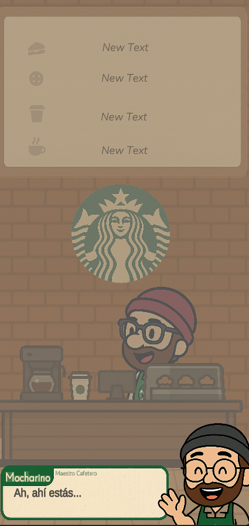
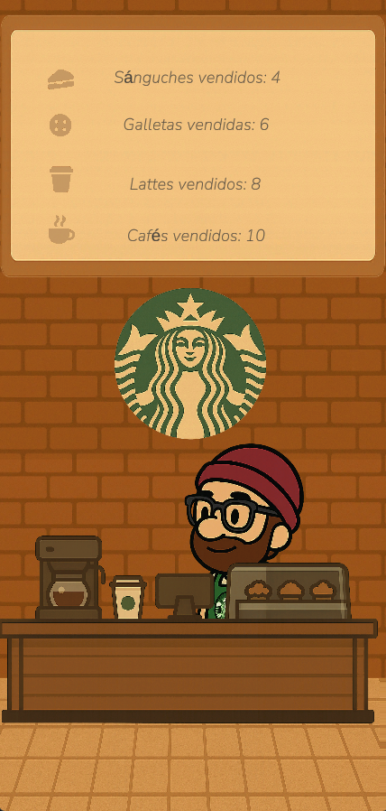

# 🎮 Simulador de Tienda de Café
Este es un pequeño proyecto de carga y descarga de datos que utiliza funciones de LINQ, Aggregate, generadores, tuplas y time slicing.
Normalmente no subiría este tipo de proyectos de forma pública, pero este resultó ser visualmente tan atractivo que no quiero perderlo en el infinito espacio del disco duro de mi computadora.
Un personaje carga un diálogo; luego, el programa instancia en cadena a tres compradores y posteriormente carga los datos.
Sinceramente, la mayor parte del trabajo está oculta, ya que se muestra principalmente en la consola.

# 🎮 Coffee Shop Simulator
This is a small project focused on loading and unloading data using LINQ functions, Aggregate, generators, tuples, and time slicing.
I don't usually publish projects of this kind, but this one turned out to be visually appealing enough that I didn't want it to disappear into the endless void of my hard drive.
A character loads a dialogue, then the program sequentially instantiates three buyers, and finally loads the data.
Honestly, most of the work happens behind the scenes, as it's mainly demonstrated through the console.

## 🖼️ Capturas

  
  
  

## 📦 Descargar

